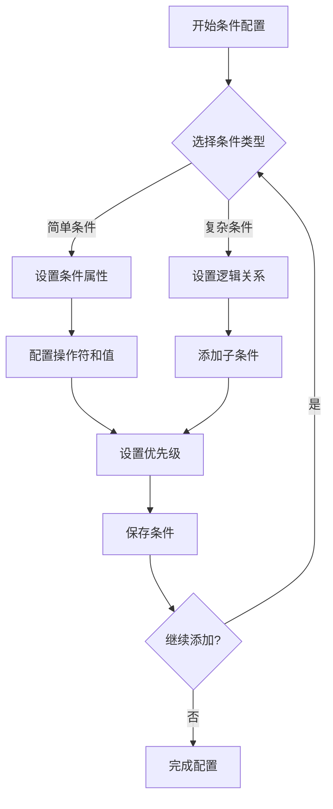

# CPQ规则配置前端开发文档

## 1. 项目概述

### 1.1 项目背景
CPQ（Configure, Price, Quote）规则配置系统是一个用于管理BOM（Bill of Materials）规则条件和动作配置的前端应用。该系统支持复杂的规则条件配置和动作执行流程管理。

### 1.2 核心功能
- 规则条件配置管理
- 动作执行配置管理
- 规则执行日志查看
- 变量和模板管理
- 用户权限控制

## 2. 技术架构

### 2.1 前端技术栈
- **框架**: Vue 3 + TypeScript
- **UI组件库**: Element Plus
- **状态管理**: Pinia
- **路由管理**: Vue Router 4
- **HTTP客户端**: Axios
- **构建工具**: Vite
- **代码规范**: ESLint + Prettier

### 2.2 项目结构
```
src/
├── api/           # API接口定义
├── components/    # 通用组件
├── views/         # 页面组件
├── store/         # 状态管理
├── router/        # 路由配置
├── utils/         # 工具函数
├── types/         # TypeScript类型定义
└── assets/        # 静态资源
```

## 3. 业务逻辑和功能需求

### 3.1 规则条件配置模块

#### 3.1.1 功能需求
1. **条件树形展示**
   - 支持嵌套条件的树形结构展示
   - 支持条件的展开/折叠操作
   - 显示条件的层级关系和逻辑关系

2. **条件增删改查**
   - 添加简单条件（叶子节点）
   - 添加复杂条件组（父节点）
   - 编辑条件属性
   - 删除条件及其子条件
   - 批量删除操作

3. **条件拖拽排序**
   - 支持条件的拖拽排序
   - 支持条件在不同层级间的移动
   - 自动更新优先级和父子关系

#### 3.1.2 业务规则
- 条件类型分为简单条件（simple）和复杂条件（complex）
- 复杂条件可以包含多个子条件，子条件可以是简单条件或复杂条件
- 条件之间支持AND/OR逻辑关系
- 每个条件都有优先级属性，用于执行顺序控制

### 3.2 动作执行配置模块

#### 3.2.1 功能需求
1. **动作链配置**
   - 配置动作的执行顺序和依赖关系
   - 支持动作的嵌套和分组
   - 设置动作的执行条件和回调函数

2. **动作参数配置**
   - 动态参数表单生成
   - JSON参数编辑器
   - 参数验证和预览

3. **动作模板管理**
   - 预定义动作模板库
   - 模板的导入/导出功能
   - 模板版本管理

#### 3.2.2 业务规则
- 动作支持多种类型：计算、验证、通知、数据操作等
- 动作可以配置执行条件和失败处理策略
- 支持动作的重试机制和超时设置
- 动作执行结果支持回调处理

### 3.3 规则执行监控模块

#### 3.3.1 功能需求
1. **执行日志查看**
   - 实时执行日志展示
   - 执行状态跟踪（成功、失败、进行中）
   - 错误信息详情查看

2. **执行统计**
   - 执行成功率统计
   - 执行时长分析
   - 错误类型分布

3. **执行重试管理**
   - 失败执行的重新执行
   - 批量重试操作
   - 重试历史记录

## 4. API接口文档

### 4.1 规则条件配置接口

#### 4.1.1 获取规则条件列表
- **接口路径**: `/cpq/ruleCondition/listByRuleId/{ruleId}`
- **请求方法**: GET
- **请求参数**:
  - ruleId: 规则ID（路径参数）
- **响应数据**: 条件树形结构数组

#### 4.1.2 保存规则条件
- **接口路径**: `/cpq/ruleCondition`
- **请求方法**: POST
- **请求参数**: 规则条件对象（支持嵌套结构）
- **响应数据**: 保存后的条件对象

#### 4.1.3 更新规则条件
- **接口路径**: `/cpq/ruleCondition`
- **请求方法**: PUT
- **请求参数**: 更新后的条件对象
- **响应数据**: 操作结果

#### 4.1.4 删除规则条件
- **接口路径**: `/cpq/ruleCondition/{conditionId}`
- **请求方法**: DELETE
- **请求参数**: conditionId（路径参数）
- **响应数据**: 操作结果

### 4.2 动作配置接口

#### 4.2.1 获取动作列表
- **接口路径**: `/cpq/ruleAction/listByRuleId/{ruleId}`
- **请求方法**: GET
- **请求参数**: ruleId（路径参数）
- **响应数据**: 动作树形结构数组

#### 4.2.2 保存动作配置
- **接口路径**: `/cpq/ruleAction`
- **请求方法**: POST
- **请求参数**: 动作配置对象
- **响应数据**: 保存后的动作对象

### 4.3 执行日志接口

#### 4.3.1 获取执行日志
- **接口路径**: `/cpq/actionExecutionLog/list`
- **请求方法**: GET
- **请求参数**: 分页和查询条件
- **响应数据**: 分页的执行日志列表

## 5. UI/UX设计规范

### 5.1 设计原则
- **一致性**: 保持界面元素和交互方式的一致性
- **可用性**: 确保界面易于理解和使用
- **效率**: 优化用户操作流程，减少不必要的步骤
- **反馈**: 及时提供操作反馈和状态提示

### 5.2 色彩方案
- **主色调**: #409EFF（Element Plus 蓝色）
- **成功色**: #67C23A
- **警告色**: #E6A23C
- **错误色**: #F56C6C
- **文字色**: #303133（主要文字）
- **辅助色**: #909399（次要文字）

### 5.3 组件规范

#### 5.3.1 条件配置组件
```vue
<template>
  <div class="condition-tree">
    <el-tree
      :data="conditionData"
      :props="treeProps"
      node-key="conditionId"
      draggable
      @node-drop="handleNodeDrop"
    >
      <template #default="{ node, data }">
        <condition-node :node="node" :data="data" />
      </template>
    </el-tree>
  </div>
</template>
```

#### 5.3.2 动作配置表单
```vue
<template>
  <el-form :model="actionForm" :rules="rules" label-width="120px">
    <el-form-item label="动作类型" prop="actionType">
      <el-select v-model="actionForm.actionType" @change="handleTypeChange">
        <el-option
          v-for="type in actionTypes"
          :key="type.value"
          :label="type.label"
          :value="type.value"
        />
      </el-select>
    </el-form-item>
    
    <!-- 动态参数表单 -->
    <component
      :is="dynamicFormComponent"
      v-model="actionForm.actionParams"
    />
  </el-form>
</template>
```

### 5.4 响应式设计
- **桌面端**: 1200px+，完整功能展示
- **平板端**: 768px-1199px，适配布局
- **移动端**: <768px，简化操作流程

## 6. 用户工作流程

### 6.1 规则配置流程
1. **创建规则** → 2. **配置条件** → 3. **配置动作** → 4. **测试规则** → 5. **发布规则**

### 6.2 条件配置流程
1. **选择条件类型** → 2. **设置条件属性** → 3. **配置逻辑关系** → 4. **设置优先级** → 5. **保存条件**

### 6.3 动作配置流程
1. **选择动作类型** → 2. **配置动作参数** → 3. **设置执行条件** → 4. **配置回调函数** → 5. **保存动作**

## 7. 前端开发指南

### 7.1 项目初始化

#### 7.1.1 环境要求
- Node.js >= 16.0.0
- npm >= 8.0.0 或 yarn >= 1.22.0
- Vue 3.2+
- TypeScript 4.5+

#### 7.1.2 项目创建
```bash
# 使用Vite创建项目
npm create vite@latest cpq-frontend -- --template vue-ts

# 安装依赖
cd cpq-frontend
npm install

# 安装核心依赖
npm install element-plus @element-plus/icons-vue
npm install pinia vue-router@4 axios
npm install -D @types/node

# 启动开发服务器
npm run dev
```

### 7.2 代码规范

#### 7.2.1 命名规范
- **组件名**: PascalCase（如：ConditionTree）
- **变量名**: camelCase（如：conditionData）
- **常量名**: UPPER_SNAKE_CASE（如：ACTION_TYPES）
- **文件名**: kebab-case（如：condition-tree.vue）
- **接口名**: I前缀 + PascalCase（如：IConditionNode）
- **类型名**: PascalCase（如：ConditionType）

#### 7.2.2 目录结构规范
```
src/
├── api/              # API接口定义
│   ├── condition.ts  # 条件相关接口
│   ├── action.ts     # 动作相关接口
│   └── index.ts      # 接口导出
├── components/       # 通用组件
│   ├── common/       # 基础组件
│   ├── business/     # 业务组件
│   └── index.ts      # 组件导出
├── views/            # 页面组件
│   ├── condition/    # 条件配置页面
│   ├── action/       # 动作配置页面
│   └── log/          # 日志查看页面
├── store/            # 状态管理
│   ├── condition.ts  # 条件状态
│   ├── action.ts     # 动作状态
│   └── index.ts      # store导出
├── router/           # 路由配置
│   └── index.ts      # 路由定义
├── utils/            # 工具函数
│   ├── request.ts    # 请求封装
│   ├── validate.ts   # 验证工具
│   └── tree.ts       # 树形工具
├── types/            # TypeScript类型定义
│   ├── condition.ts  # 条件类型
│   ├── action.ts     # 动作类型
│   └── api.ts        # API类型
├── assets/           # 静态资源
│   ├── styles/       # 样式文件
│   └── images/       # 图片资源
└── main.ts           # 应用入口
```

### 7.3 组件开发最佳实践

#### 7.3.1 组件设计原则
```typescript
// 条件节点组件示例
import { defineComponent, PropType, computed } from 'vue'
import type { IConditionNode } from '@/types/condition'

export default defineComponent({
  name: 'ConditionNode',
  props: {
    node: {
      type: Object as PropType<any>,
      required: true
    },
    data: {
      type: Object as PropType<IConditionNode>,
      required: true
    }
  },
  emits: ['edit', 'delete', 'add-child'],
  setup(props, { emit }) {
    // 计算属性
    const conditionTypeText = computed(() => {
      return props.data.configType === 'simple' ? '简单条件' : '复杂条件'
    })
    
    // 方法
    const handleEdit = () => {
      emit('edit', props.data)
    }
    
    const handleDelete = () => {
      emit('delete', props.data)
    }
    
    const handleAddChild = () => {
      emit('add-child', props.data)
    }
    
    return {
      conditionTypeText,
      handleEdit,
      handleDelete,
      handleAddChild
    }
  }
})
```

#### 7.3.2 组件通信规范
```typescript
// 父组件向子组件传递数据
<template>
  <condition-tree
    :conditions="conditionData"
    @condition-change="handleConditionChange"
    @condition-delete="handleConditionDelete"
  />
</template>

// 子组件定义
props: {
  conditions: {
    type: Array as PropType<IConditionNode[]>,
    required: true
  }
},
emits: ['condition-change', 'condition-delete']
```

### 7.4 状态管理最佳实践

#### 7.4.1 Store设计模式
```typescript
// stores/condition.ts
import { defineStore } from 'pinia'
import type { IConditionState, IConditionNode } from '@/types/condition'
import { conditionApi } from '@/api/condition'

export const useConditionStore = defineStore('condition', {
  state: (): IConditionState => ({
    conditionTree: [],
    currentCondition: null,
    loading: false,
    error: null
  }),
  
  getters: {
    // 获取扁平化的条件列表
    flatConditions: (state) => {
      const flatten = (nodes: IConditionNode[]): IConditionNode[] => {
        return nodes.reduce((acc, node) => {
          acc.push(node)
          if (node.children && node.children.length > 0) {
            acc.push(...flatten(node.children))
          }
          return acc
        }, [] as IConditionNode[])
      }
      return flatten(state.conditionTree)
    },
    
    // 根据ID获取条件
    getConditionById: (state) => (id: number) => {
      return state.flatConditions.find(condition => condition.conditionId === id)
    }
  },
  
  actions: {
    // 异步获取条件数据
    async fetchConditions(ruleId: number) {
      this.loading = true
      this.error = null
      
      try {
        const data = await conditionApi.getConditionList(ruleId)
        this.conditionTree = data
      } catch (error) {
        this.error = error as Error
        throw error
      } finally {
        this.loading = false
      }
    },
    
    // 保存条件
    async saveCondition(condition: IConditionNode) {
      try {
        const savedCondition = await conditionApi.saveCondition(condition)
        
        // 更新本地状态
        if (condition.conditionId) {
          // 更新现有条件
          this.updateConditionInTree(savedCondition)
        } else {
          // 添加新条件
          this.addConditionToTree(savedCondition)
        }
        
        return savedCondition
      } catch (error) {
        this.error = error as Error
        throw error
      }
    },
    
    // 辅助方法：在树中更新条件
    updateConditionInTree(updatedCondition: IConditionNode) {
      const updateNode = (nodes: IConditionNode[]): boolean => {
        for (let i = 0; i < nodes.length; i++) {
          if (nodes[i].conditionId === updatedCondition.conditionId) {
            nodes[i] = { ...nodes[i], ...updatedCondition }
            return true
          }
          if (nodes[i].children && updateNode(nodes[i].children)) {
            return true
          }
        }
        return false
      }
      
      updateNode(this.conditionTree)
    }
  }
})
```

### 7.5 API封装最佳实践

#### 7.5.1 请求拦截器
```typescript
// utils/request.ts
import axios from 'axios'
import { ElMessage } from 'element-plus'
import type { AxiosRequestConfig, AxiosResponse } from 'axios'

// 创建axios实例
const request = axios.create({
  baseURL: import.meta.env.VITE_API_BASE_URL,
  timeout: 10000,
  headers: {
    'Content-Type': 'application/json'
  }
})

// 请求拦截器
request.interceptors.request.use(
  (config: AxiosRequestConfig) => {
    // 添加认证token
    const token = localStorage.getItem('token')
    if (token && config.headers) {
      config.headers.Authorization = `Bearer ${token}`
    }
    
    // 添加时间戳防止缓存
    if (config.method?.toLowerCase() === 'get') {
      config.params = {
        ...config.params,
        _t: Date.now()
      }
    }
    
    return config
  },
  (error) => {
    return Promise.reject(error)
  }
)

// 响应拦截器
request.interceptors.response.use(
  (response: AxiosResponse) => {
    const { data } = response
    
    // 统一处理响应格式
    if (data.code === 200) {
      return data.data
    } else {
      // 业务错误
      ElMessage.error(data.msg || '操作失败')
      return Promise.reject(new Error(data.msg))
    }
  },
  (error) => {
    // 网络错误或服务器错误
    if (error.response) {
      const { status, data } = error.response
      
      switch (status) {
        case 401:
          ElMessage.error('未授权，请重新登录')
          // 跳转到登录页
          break
        case 403:
          ElMessage.error('权限不足')
          break
        case 404:
          ElMessage.error('请求的资源不存在')
          break
        case 500:
          ElMessage.error('服务器内部错误')
          break
        default:
          ElMessage.error(data?.msg || '网络错误')
      }
    } else {
      ElMessage.error('网络连接失败')
    }
    
    return Promise.reject(error)
  }
)

export default request
```

#### 7.5.2 API模块化封装
```typescript
// api/condition.ts
import request from '@/utils/request'
import type { IConditionNode, IConditionListParams } from '@/types/condition'

export const conditionApi = {
  // 获取规则条件列表
  getConditionList(ruleId: number): Promise<IConditionNode[]> {
    return request.get(`/cpq/ruleCondition/listByRuleId/${ruleId}`)
  },
  
  // 保存规则条件
  saveCondition(condition: IConditionNode): Promise<IConditionNode> {
    return condition.conditionId 
      ? request.put('/cpq/ruleCondition', condition)
      : request.post('/cpq/ruleCondition', condition)
  },
  
  // 删除规则条件
  deleteCondition(conditionId: number): Promise<void> {
    return request.delete(`/cpq/ruleCondition/${conditionId}`)
  },
  
  // 批量删除规则条件
  deleteConditions(conditionIds: number[]): Promise<void> {
    return request.delete('/cpq/ruleCondition/batch', {
      data: { conditionIds }
    })
  }
}
```

### 7.6 错误处理最佳实践

#### 7.6.1 全局错误处理
```typescript
// utils/errorHandler.ts
export class AppError extends Error {
  constructor(
    message: string,
    public code: string,
    public details?: any
  ) {
    super(message)
    this.name = 'AppError'
  }
}

export function handleApiError(error: any): never {
  if (error instanceof AppError) {
    throw error
  }
  
  if (error.response) {
    const { status, data } = error.response
    
    switch (status) {
      case 400:
        throw new AppError('请求参数错误', 'VALIDATION_ERROR', data)
      case 401:
        throw new AppError('未授权访问', 'UNAUTHORIZED')
      case 403:
        throw new AppError('权限不足', 'FORBIDDEN')
      case 404:
        throw new AppError('资源不存在', 'NOT_FOUND')
      case 500:
        throw new AppError('服务器错误', 'SERVER_ERROR')
      default:
        throw new AppError(data?.msg || '网络错误', 'NETWORK_ERROR')
    }
  } else {
    throw new AppError('网络连接失败', 'NETWORK_ERROR')
  }
}

// 在组件中使用
try {
  await conditionStore.saveCondition(condition)
  ElMessage.success('保存成功')
} catch (error) {
  handleApiError(error)
}
```

#### 7.6.2 用户友好错误提示
```typescript
// utils/errorMessages.ts
export const ERROR_MESSAGES = {
  VALIDATION_ERROR: '输入数据有误，请检查后重试',
  UNAUTHORIZED: '登录已过期，请重新登录',
  FORBIDDEN: '您没有权限执行此操作',
  NOT_FOUND: '请求的资源不存在',
  SERVER_ERROR: '服务器繁忙，请稍后重试',
  NETWORK_ERROR: '网络连接失败，请检查网络设置',
  DEFAULT: '操作失败，请稍后重试'
}

export function getErrorMessage(code: string): string {
  return ERROR_MESSAGES[code as keyof typeof ERROR_MESSAGES] || ERROR_MESSAGES.DEFAULT
}
```

### 7.7 性能优化指南

#### 7.7.1 组件优化
```typescript
// 使用v-memo优化大型列表
<template>
  <div v-for="item in largeList" :key="item.id" v-memo="[item.id, item.name]">
    {{ item.name }}
  </div>
</template>

// 使用Teleport优化模态框
<template>
  <teleport to="body">
    <el-dialog v-model="visible">
      <!-- 对话框内容 -->
    </el-dialog>
  </teleport>
</template>
```

#### 7.7.2 数据优化
```typescript
// 使用虚拟滚动优化大数据量
import { ElTableV2 } from 'element-plus'

<template>
  <el-table-v2
    :columns="columns"
    :data="largeData"
    :height="400"
    fixed
  />
</template>

// 使用防抖优化搜索
import { debounce } from 'lodash-es'

const handleSearch = debounce((keyword: string) => {
  // 搜索逻辑
}, 300)
```

## 8. 用户工作流程和交互设计

### 8.1 规则配置完整流程

#### 8.1.1 创建新规则
1. **进入规则管理页面** → 2. **点击"新建规则"按钮** → 3. **填写规则基本信息** → 4. **保存规则** → 5. **进入条件配置页面**

#### 8.1.2 条件配置流程


#### 8.1.3 动作配置流程
1. **进入动作配置页面** → 2. **选择动作类型** → 3. **配置动作参数** → 4. **设置执行条件** → 5. **配置回调函数** → 6. **保存动作** → 7. **调整执行顺序**

### 8.2 关键交互场景

#### 8.2.1 条件树操作交互
```vue
<template>
  <div class="condition-tree-container">
    <!-- 条件树展示 -->
    <el-tree
      ref="treeRef"
      :data="conditionTree"
      :props="treeProps"
      node-key="conditionId"
      draggable
      :allow-drop="allowDrop"
      @node-drop="handleNodeDrop"
      @node-click="handleNodeClick"
    >
      <template #default="{ node, data }">
        <condition-node
          :node="node"
          :data="data"
          @edit="handleEditCondition"
          @delete="handleDeleteCondition"
          @add-child="handleAddChildCondition"
        />
      </template>
    </el-tree>
    
    <!-- 操作工具栏 -->
    <div class="tree-toolbar">
      <el-button type="primary" @click="handleAddRootCondition">
        <el-icon><Plus /></el-icon>
        添加根条件
      </el-button>
      <el-button @click="handleExpandAll">
        <el-icon><Expand /></el-icon>
        展开全部
      </el-button>
      <el-button @click="handleCollapseAll">
        <el-icon><Fold /></el-icon>
        折叠全部
      </el-button>
    </div>
  </div>
</template>

<script setup lang="ts">
import { ref } from 'vue'
import type { IConditionNode } from '@/types/condition'

const treeRef = ref()
const conditionTree = ref<IConditionNode[]>([])

// 拖拽验证
const allowDrop = (draggingNode: any, dropNode: any, type: string) => {
  // 不允许将简单条件作为父节点
  if (type === 'inner' && draggingNode.data.configType === 'simple') {
    return false
  }
  return true
}

// 节点拖拽完成
const handleNodeDrop = async (draggingNode: any, dropNode: any, type: string) => {
  try {
    // 更新父子关系和优先级
    await updateConditionHierarchy(draggingNode.data, dropNode.data, type)
    ElMessage.success('条件顺序已更新')
  } catch (error) {
    ElMessage.error('更新失败')
    // 回滚拖拽操作
    treeRef.value?.updateKeyChildren()
  }
}

// 添加根条件
const handleAddRootCondition = () => {
  // 打开条件编辑对话框
  openConditionDialog({
    configType: 'complex',
    logic: 'AND',
    priority: conditionTree.value.length + 1
  })
}
</script>
```

#### 8.2.2 条件编辑交互
```vue
<template>
  <el-dialog
    :title="dialogTitle"
    v-model="dialogVisible"
    width="700px"
    :before-close="handleDialogClose"
  >
    <el-form
      ref="formRef"
      :model="formData"
      :rules="formRules"
      label-width="120px"
      label-position="left"
    >
      <!-- 条件类型选择 -->
      <el-form-item label="条件类型" prop="configType">
        <el-radio-group v-model="formData.configType" @change="handleTypeChange">
          <el-radio-button label="simple">简单条件</el-radio-button>
          <el-radio-button label="complex">复杂条件</el-radio-button>
        </el-radio-group>
      </el-form-item>

      <!-- 动态表单区域 -->
      <div v-if="formData.configType === 'simple'">
        <el-form-item label="数据类型" prop="type">
          <el-select v-model="formData.type" placeholder="请选择数据类型">
            <el-option
              v-for="type in dataTypes"
              :key="type.value"
              :label="type.label"
              :value="type.value"
            />
          </el-select>
        </el-form-item>

        <el-form-item label="判断类型" prop="judgeType">
          <el-select v-model="formData.judgeType" placeholder="请选择判断类型">
            <el-option
              v-for="judgeType in judgeTypes"
              :key="judgeType.value"
              :label="judgeType.label"
              :value="judgeType.value"
            />
          </el-select>
        </el-form-item>

        <!-- 动态字段配置 -->
        <template v-if="formData.judgeType">
          <el-form-item label="节点" prop="node" v-if="requiresNode">
            <el-select v-model="formData.node" placeholder="请选择节点">
              <el-option
                v-for="node in availableNodes"
                :key="node.id"
                :label="node.name"
                :value="node.id"
              />
            </el-select>
          </el-form-item>

          <el-form-item label="字段" prop="field" v-if="requiresField">
            <el-select v-model="formData.field" placeholder="请选择字段">
              <el-option
                v-for="field in availableFields"
                :key="field.name"
                :label="field.label"
                :value="field.name"
              />
            </el-select>
          </el-form-item>
        </template>

        <el-form-item label="操作符" prop="operator">
          <el-select v-model="formData.operator" placeholder="请选择操作符">
            <el-option
              v-for="op in availableOperators"
              :key="op.value"
              :label="op.label"
              :value="op.value"
            />
          </el-select>
        </el-form-item>

        <el-form-item label="比较值" prop="value">
          <component
            :is="valueInputComponent"
            v-model="formData.value"
            :type="formData.type"
            :options="valueOptions"
          />
        </el-form-item>
      </div>

      <!-- 复杂条件配置 -->
      <div v-else>
        <el-form-item label="逻辑关系" prop="logic">
          <el-radio-group v-model="formData.logic">
            <el-radio label="AND">AND（与） - 所有子条件都必须满足</el-radio>
            <el-radio label="OR">OR（或） - 任意一个子条件满足即可</el-radio>
          </el-radio-group>
        </el-form-item>
        
        <el-form-item label="条件描述">
          <el-input
            v-model="formData.description"
            type="textarea"
            :rows="2"
            placeholder="请输入条件组的描述信息"
          />
        </el-form-item>
      </div>

      <el-form-item label="优先级" prop="priority">
        <el-input-number
          v-model="formData.priority"
          :min="1"
          :max="100"
          controls-position="right"
        />
        <span class="priority-tip">数字越小优先级越高</span>
      </el-form-item>
    </el-form>

    <template #footer>
      <el-button @click="handleDialogClose">取消</el-button>
      <el-button type="primary" :loading="submitting" @click="handleSubmit">
        {{ submitting ? '保存中...' : '保存' }}
      </el-button>
    </template>
  </el-dialog>
</template>

<script setup lang="ts">
import { computed, ref, watch } from 'vue'
import type { IConditionNode } from '@/types/condition'

const props = defineProps<{
  visible: boolean
  condition?: IConditionNode
  parentCondition?: IConditionNode
}>()

const emit = defineEmits<{
  (e: 'update:visible', value: boolean): void
  (e: 'saved', condition: IConditionNode): void
}>()

const dialogVisible = computed({
  get: () => props.visible,
  set: (value) => emit('update:visible', value)
})

const dialogTitle = computed(() => {
  return props.condition ? '编辑条件' : '添加条件'
})

// 监听条件类型变化，动态更新可用字段
watch(() => formData.value.configType, (newType) => {
  if (newType === 'simple') {
    // 重置简单条件相关字段
    formData.value.logic = ''
  } else {
    // 重置复杂条件相关字段
    formData.value.type = ''
    formData.value.judgeType = ''
    formData.value.node = ''
    formData.value.field = ''
    formData.value.operator = ''
    formData.value.value = ''
  }
})
</script>
```

### 8.3 用户体验优化

#### 8.3.1 实时验证和反馈
```typescript
// 条件表单验证规则
const formRules = {
  configType: [
    { required: true, message: '请选择条件类型', trigger: 'change' }
  ],
  type: [
    { 
      required: true, 
      message: '请选择数据类型', 
      trigger: 'change',
      validator: (rule: any, value: string, callback: any) => {
        if (formData.value.configType === 'simple' && !value) {
          callback(new Error('请选择数据类型'))
        } else {
          callback()
        }
      }
    }
  ],
  operator: [
    { 
      required: true, 
      message: '请选择操作符', 
      trigger: 'change',
      validator: (rule: any, value: string, callback: any) => {
        if (formData.value.configType === 'simple' && !value) {
          callback(new Error('请选择操作符'))
        } else {
          callback()
        }
      }
    }
  ],
  value: [
    { 
      required: true, 
      message: '请输入比较值', 
      trigger: 'blur',
      validator: (rule: any, value: string, callback: any) => {
        if (formData.value.configType === 'simple' && !value) {
          callback(new Error('请输入比较值'))
        } else {
          callback()
        }
      }
    }
  ],
  logic: [
    { 
      required: true, 
      message: '请选择逻辑关系', 
      trigger: 'change',
      validator: (rule: any, value: string, callback: any) => {
        if (formData.value.configType === 'complex' && !value) {
          callback(new Error('请选择逻辑关系'))
        } else {
          callback()
        }
      }
    }
  ]
}
```

#### 8.3.2 智能提示和帮助
```vue
<template>
  <el-form-item label="操作符" prop="operator">
    <el-select v-model="formData.operator" placeholder="请选择操作符">
      <el-option
        v-for="op in availableOperators"
        :key="op.value"
        :label="op.label"
        :value="op.value"
      />
    </el-select>
    <el-tooltip placement="top">
      <template #content>
        <div class="operator-help">
          <p><strong>等于（=）</strong>: 精确匹配值</p>
          <p><strong>大于（>）</strong>: 值大于指定值</p>
          <p><strong>包含（like）</strong>: 包含指定文本</p>
          <p><strong>在...中（in）</strong>: 值在指定列表中</p>
        </div>
      </template>
      <el-icon class="help-icon"><QuestionFilled /></el-icon>
    </el-tooltip>
  </el-form-item>
</template>

<style scoped>
.help-icon {
  margin-left: 8px;
  color: #909399;
  cursor: help;
}

.operator-help {
  max-width: 300px;
}

.operator-help p {
  margin: 4px 0;
  font-size: 12px;
}
</style>
```

## 9. 测试策略

### 9.1 单元测试
- 组件功能测试
- 工具函数测试
- Store状态测试

### 9.2 集成测试
- 页面流程测试
- API接口测试
- 用户交互测试

### 9.3 E2E测试
- 完整业务流程测试
- 跨浏览器兼容性测试
- 性能测试

## 10. 部署和运维

### 10.1 构建配置
```javascript
// vite.config.js
export default defineConfig({
  build: {
    rollupOptions: {
      output: {
        manualChunks: {
          vendor: ['vue', 'vue-router', 'pinia'],
          element: ['element-plus']
        }
      }
    }
  }
})
```

### 10.2 环境配置
- 开发环境：本地开发服务器
- 测试环境：集成测试环境
- 生产环境：正式发布环境

## 11. 附录

### 11.1 参考资料
- [Vue 3官方文档](https://v3.vuejs.org/)
- [Element Plus文档](https://element-plus.org/)
- [TypeScript手册](https://www.typescriptlang.org/docs/)

### 11.2 更新日志
- v1.0.0: 初始版本，基础功能实现
- v1.1.0: 增加条件拖拽功能
- v1.2.0: 优化动作配置界面

---

*本文档将持续更新，以反映最新的功能变更和最佳实践。*