# 用户选型配置器使用指南

## 📚 目录

1. [功能概述](#功能概述)
2. [快速开始](#快速开始)
3. [核心功能说明](#核心功能说明)
4. [技术实现亮点](#技术实现亮点)
5. [后端接口要求](#后端接口要求)
6. [开发调试](#开发调试)
7. [常见问题](#常见问题)

---

## 功能概述

用户选型配置器是一个基于超级BOM规则配置的前端CPQ（Configure, Price, Quote）产品配置工具，提供以下核心功能：

### ✨ 主要特性

- **可视化产品结构树**：树形展示BOM层级结构，支持节点状态标识
- **动态属性配置**：支持12+种输入类型的属性配置
- **实时规则验证**：前端规则引擎实时校验配置合规性
- **智能约束处理**：自动处理节点依赖、数量约束、互斥关系
- **实时价格计算**：配置变更自动触发价格重新计算
- **配置会话管理**：支持保存、加载、分享配置方案
- **配置摘要面板**：实时展示配置进度和价格明细

---

## 快速开始

### 1. 文件结构

```
src/
├── views/cpq/configurator/              # 配置器主目录
│   ├── list.vue                         # 配置选型列表页（入口）
│   ├── index.vue                        # 配置器详情页
│   └── components/
│       ├── ProductTree.vue              # 产品结构树组件
│       ├── AttributeConfig.vue          # 属性配置组件
│       └── ConfigurationSummary.vue     # 配置摘要组件
├── store/modules/
│   └── configurator.js                  # Pinia Store状态管理
├── utils/
│   └── ruleEngine.js                    # 前端规则引擎
└── api/cpq/
    └── configSession.js                 # 配置会话API
```

### 2. 路由配置

已在 `src/router/index.js` 中配置为**静态路由**（不依赖后端配置）：

```javascript
// CPQ系统 - 产品配置器（静态路由）
{
  path: '/cpq',
  component: () => import('@/layout/index.vue'),
  redirect: '/cpq/configurator',
  name: 'Cpq',
  meta: { title: 'CPQ系统', icon: 'shopping', alwaysShow: true },
  children: [
    {
      path: 'configurator',
      component: () => import('@/views/cpq/configurator/list.vue'),
      name: 'CpqConfigurator',
      meta: { title: '产品配置器', icon: 'setting' }
    },
    {
      path: 'configurator/:bomId',
      component: () => import('@/views/cpq/configurator/index.vue'),
      name: 'CpqConfiguratorDetail',
      meta: { title: '配置详情', icon: 'setting' },
      hidden: true
    }
  ]
}
```

**注意：** 本项目使用动态路由机制，但为了快速使用，将配置器路由配置为静态路由。如需权限控制，可后续迁移到动态路由。

### 3. 使用流程

#### 步骤1：访问配置选型列表页

**方式1：从菜单访问（推荐）**
- 点击左侧菜单：`CPQ系统` → `产品配置器`
- 系统自动导航到配置选型列表页

**方式2：直接访问URL**
- 访问地址：`http://your-domain/cpq/configurator`

**页面功能：** 展示所有可用的BOM方案（卡片形式）
- 支持搜索和分页
- 显示BOM基本信息、统计数据

#### 步骤2：选择BOM方案

点击"开始配置"按钮，跳转到配置详情页：
`http://your-domain/cpq/configurator/123` (123为bomId)

#### 步骤3：进行产品配置

- 左侧：产品结构树
- 中间：属性配置面板
- 右侧：配置摘要

#### 步骤4：完成配置

- 保存配置：保存当前配置状态
- 完成配置：提交最终配置方案
- 返回列表：返回配置选型列表页

### 4. 使用示例

#### 4.1 从菜单访问（推荐）

点击左侧菜单 **CPQ系统 → 产品配置器**，进入配置选型列表页

#### 4.2 编程方式跳转到列表页

```vue
<script setup>
import { useRouter } from 'vue-router'

const router = useRouter()

// 跳转到配置选型列表
const goToConfiguratorList = () => {
  router.push({ name: 'CpqConfigurator' })
}
</script>
```

#### 4.3 编程方式跳转到配置详情页

```vue
<script setup>
import { useRouter } from 'vue-router'

const router = useRouter()

// 跳转到指定BOM的配置页面
const startConfiguration = (bomId, bomName) => {
  router.push({
    name: 'CpqConfiguratorDetail',
    params: { bomId },
    query: { bomName }
  })
}
</script>
```

#### 4.4 直接使用Store

```vue
<script setup>
import { onMounted } from 'vue'
import { useConfiguratorStore } from '@/store/modules/configurator'

const configuratorStore = useConfiguratorStore()

onMounted(async () => {
  // 加载BOM结构
  await configuratorStore.loadBomStructure(123)
  
  // 获取配置摘要
  console.log(configuratorStore.configurationSummary)
  
  // 保存配置
  await configuratorStore.saveConfigSession()
})
</script>
```

---

## 核心功能说明

### 📊 1. 产品结构树（ProductTree）

#### 功能特点

- ✅ 树形展示BOM层级结构
- ✅ 节点状态可视化（未配置、已配置、错误、禁用）
- ✅ 节点搜索和快速定位
- ✅ 必选/可选标识
- ✅ 动态显示/隐藏（基于规则）

#### 节点状态说明

| 状态 | 图标 | 颜色 | 说明 |
|-----|------|------|------|
| `unconfigured` | - | 灰色 | 未配置 |
| `configured` | ✓ | 绿色 | 已配置 |
| `partial` | - | 黄色 | 部分配置 |
| `error` | ! | 红色 | 配置错误 |
| `disabled` | - | 灰色透明 | 禁用（不满足约束） |

#### 使用示例

```vue
<ProductTree
  :bom-id="bomId"
  @node-select="handleNodeSelect"
/>

<script setup>
const handleNodeSelect = (node) => {
  console.log('选中节点:', node)
  // node包含: bomStructureId, nodeName, status, isRequired等
}
</script>
```

---

### ⚙️ 2. 属性配置（AttributeConfig）

#### 支持的属性类型

| 类型 | 组件 | 适用场景 |
|-----|------|---------|
| `text` | el-input | 文本输入（如：产品名称） |
| `number` | el-input-number | 数值输入（如：重量、尺寸） |
| `select` | el-select | 单选下拉（如：颜色、型号） |
| `multi` | el-select(multiple) | 多选下拉（如：配件选择） |
| `radio` | el-radio-group | 单选按钮组 |
| `checkbox` | el-checkbox-group | 多选按钮组 |
| `date` | el-date-picker | 日期选择 |
| `datetime` | el-date-picker(datetime) | 日期时间选择 |
| `textarea` | el-input(textarea) | 多行文本 |
| `slider` | el-slider | 滑块（如：亮度、音量） |
| `switch` | el-switch | 开关（如：是否启用） |
| `color` | el-color-picker | 颜色选择器 |

#### 属性配置流程

```mermaid
graph LR
    A[选择节点] --> B[加载节点属性]
    B --> C[按属性组分组显示]
    C --> D[用户填写属性值]
    D --> E[实时规则校验]
    E --> F[保存配置]
    F --> G[更新树状态]
```



#### 属性配置数据结构

```javascript
{
  quantity: 2,                    // 数量
  selectedProductId: 101,         // 选择的产品ID
  attrs: {
    color: 'red',                 // 属性：颜色
    size: 'L',                    // 属性：尺寸
    customText: 'Hello',          // 属性：自定义文本
    features: ['wifi', 'bt']      // 属性：功能（多选）
  }
}
```

---

### 🔍 3. 规则引擎（RuleEngine）

#### 规则类型

| 类型 | 代码 | 说明 | 示例 |
|-----|------|------|------|
| 验证规则 | `1` | 校验配置合规性 | 重量必须在0-1000kg之间 |
| 计算规则 | `2` | 动态计算属性值 | 总价 = 单价 × 数量 × 折扣 |
| 条件规则 | `3` | 条件控制 | 选择红色时自动启用LED灯 |
| 跳转规则 | `4` | 流程跳转 | 完成基础配置后跳到高级配置 |

#### 规则执行流程

```javascript
// 1. 加载规则
RuleEngine.loadRules(rules)

// 2. 设置上下文
RuleEngine.setContext({
  variables: { totalPrice: 0, discount: 0.1 },
  nodes: {
    1: { attributes: { color: 'red' }, quantity: 2 }
  }
})

// 3. 评估所有规则
const result = await RuleEngine.evaluateAll()

// 结果示例
{
  passed: true,
  executedRules: [1, 3, 5],
  errors: [],
  actions: [
    { actionType: 'setProperty', result: { property: 'discount', value: 0.15 } },
    { actionType: 'showMessage', result: { messageType: 'success', message: '您获得了额外折扣' } }
  ]
}
```

#### 条件表达式示例

```javascript
// 简单条件
{
  judgeType: 'nodeStaticAttr',    // 判断类型：节点静态属性
  node: 1,                         // 节点ID
  field: 'color',                  // 字段：颜色
  operator: '=',                   // 操作符：等于
  value: 'red',                    // 值：红色
  type: 'text'                     // 类型：文本
}

// 复杂条件（嵌套）
{
  configType: 'complex',
  logic: 'AND',
  children: [
    { judgeType: 'variable', field: 'totalPrice', operator: '>', value: 1000 },
    { judgeType: 'nodeStaticAttr', node: 1, field: 'isVip', operator: '=', value: true }
  ]
}
```

#### 约束类型说明

##### 1. 条件约束

```javascript
{
  type: 'condition',
  condition: 'parent.quantity > 0'  // 父节点数量必须大于0
}
```

##### 2. 数量约束

```javascript
{
  type: 'quantity',
  quantity: {
    default: 1,
    min: 1,
    max: 10,
    minExpr: 'parent.quantity * 2',  // 动态最小值表达式
    maxExpr: 'parent.quantity * 5'   // 动态最大值表达式
  }
}
```

##### 3. 依赖约束

```javascript
{
  type: 'dependency',
  dependency: {
    nodes: [2, 3, 4],              // 依赖节点ID列表
    type: 'mandatory',              // mandatory(必选) | exclusive(互斥) | conditional(条件)
    condition: 'node2.selected'     // 条件表达式（type为conditional时使用）
  }
}
```

##### 4. 组合约束

```javascript
{
  type: 'combination',
  combination: {
    replaceableNodes: [5, 6],       // 可替换节点ID列表
    condition: 'color == "red"'     // 替换条件
  }
}
```

---

### 💰 4. 价格计算

#### 计算规则

```javascript
// 1. 基础价格 = 节点单价 × 数量
const basePrice = node.price * node.quantity

// 2. 产品价格（如果选择了产品）
const productPrice = node.product.price * node.quantity

// 3. 自定义计算规则
if (node.costCalculationRule) {
  // 支持表达式计算
  // 例: "basePrice * (1 - discount) + shippingFee"
  const calculatedPrice = evaluate(node.costCalculationRule)
}

// 4. 总价 = 所有已配置节点价格之和
const totalPrice = sum(allConfiguredNodes.map(n => n.totalPrice))
```

#### 价格明细数据结构

```javascript
{
  totalPrice: 15800.00,
  breakdown: [
    {
      nodeId: 1,
      nodeName: '主机',
      quantity: 1,
      unitPrice: 5000.00,
      totalPrice: 5000.00
    },
    {
      nodeId: 2,
      nodeName: 'CPU',
      quantity: 2,
      unitPrice: 3000.00,
      totalPrice: 6000.00
    }
  ]
}
```

---

### 💾 5. 配置会话管理

#### 会话生命周期

```
创建会话 → 配置中(draft) → 保存配置(saved) → 完成配置(completed) → 生成报价
```

#### API使用示例

```javascript
import { useConfiguratorStore } from '@/store/modules/configurator'

const configuratorStore = useConfiguratorStore()

// 1. 保存当前配置
await configuratorStore.saveConfigSession()

// 2. 加载历史配置
await configuratorStore.loadConfigSession('SESSION_1234567890')

// 3. 完成配置
const success = await configuratorStore.completeConfiguration()
if (success) {
  // 跳转到报价页面或其他操作
}

// 4. 重置配置
configuratorStore.resetConfiguration()
```

#### 会话数据结构

```javascript
{
  sessionId: 'SESSION_1701234567890',
  bomId: 123,
  sessionName: '配置会话_2024/1/3 15:30:00',
  createdAt: new Date('2024-01-03T15:30:00'),
  updatedAt: new Date('2024-01-03T16:00:00'),
  status: 'draft',              // draft | saved | completed
  configuration: {
    1: {                        // 节点ID: 配置数据
      quantity: 2,
      selectedProductId: 101,
      attrs: { color: 'red', size: 'L' }
    }
  },
  savedToBackend: false
}
```

---

## 技术实现亮点

### 🎯 1. 前端规则引擎

**优势：**
- ✅ 无需后端调用，实时响应快
- ✅ 支持复杂嵌套条件
- ✅ 安全的表达式执行环境
- ✅ 完整的规则执行日志

**核心算法：**

```javascript
// 递归评估嵌套条件
evaluateConditions(conditions) {
  let result = null
  
  for (let i = 0; i < conditions.length; i++) {
    const cond = conditions[i]
    const condResult = cond.configType === 'complex'
      ? this.evaluateConditions(cond.children)  // 递归
      : this.evaluateSingleCondition(cond)
    
    if (i === 0) {
      result = condResult
    } else {
      result = cond.logic === 'AND' 
        ? result && condResult 
        : result || condResult
    }
  }
  
  return result
}
```

### 🔄 2. 响应式状态管理

**Pinia Store优势：**
- ✅ 集中式状态管理
- ✅ TypeScript友好
- ✅ 支持DevTools调试
- ✅ 自动持久化（可扩展）

**核心Getters：**

```javascript
getters: {
  // 已配置节点
  configuredNodes: (state) => {
    return Array.from(state.nodesMap.values())
      .filter(node => node.status === 'configured')
  },
  
  // 配置完整性
  isConfigurationComplete: (state) => {
    return Array.from(state.nodesMap.values())
      .every(node => !node.isRequired || node.status === 'configured')
  },
  
  // 配置摘要
  configurationSummary: (state) => ({
    totalNodes: state.nodesMap.size,
    configuredNodes: /* ... */,
    requiredNodes: /* ... */,
    errors: /* ... */
  })
}
```

### 🧩 3. 组件化设计

**组件职责清晰：**

| 组件 | 职责 | 输入 | 输出 |
|-----|------|------|------|
| `ProductTree` | 展示BOM树 | bomId | node-select事件 |
| `AttributeConfig` | 配置属性 | currentNode | config-confirm事件 |
| `ConfigurationSummary` | 显示摘要 | - | 操作事件 |

**组件通信方式：**

```
ProductTree ----(node-select)----> index.vue
                                      |
                                      v
                             selectedNode (props)
                                      |
                                      v
                              AttributeConfig
                                      |
                                      v
                             (config-confirm)
                                      |
                                      v
                                Store更新
                                      |
                                      v
                           ConfigurationSummary自动更新
```

### 🚀 4. 性能优化

**优化策略：**

1. **虚拟滚动**（待实现）：大数据量属性列表
2. **懒加载**：节点属性按需加载
3. **缓存策略**：规则和BOM结构缓存
4. **防抖/节流**：搜索、校验等操作
5. **计算属性**：避免重复计算

```javascript
// 示例：缓存规则引擎上下文
const contextCache = new Map()

const getCachedContext = (nodeId) => {
  if (!contextCache.has(nodeId)) {
    contextCache.set(nodeId, buildContext(nodeId))
  }
  return contextCache.get(nodeId)
}
```

---

## 后端接口要求

### 必需接口列表

#### 1. BOM结构相关

```javascript
// 获取BOM树形结构
GET /cpq/bom/structure/tree?bomId=123
Response: {
  data: [
    {
      bomStructureId: 1,
      nodeName: '主机',
      nodeType: '1',
      defaultQuantity: 1,
      minQuantity: 1,
      maxQuantity: 10,
      constraintType: 'quantity',
      constraintConfig: '{ "quantity": { "min": 1, "max": 10 } }',
      children: [...]
    }
  ]
}

// 获取节点属性
GET /cpq/bom/structure/attribute/list?bomStructureId=1
Response: {
  data: [
    {
      attributeId: 1,
      attributeCode: 'color',
      attributeName: '颜色',
      attributeType: 'select',
      defaultValue: 'red',
      isRequired: '0',
      attributeGroupId: 1,
      attributeGroupName: '外观属性',
      attributeValues: [
        { valueId: 1, valueCode: 'red', valueName: '红色' },
        { valueId: 2, valueCode: 'blue', valueName: '蓝色' }
      ]
    }
  ]
}

// 获取节点关联产品
GET /cpq/bom/structure/product/list?bomStructureId=1
Response: {
  data: [
    {
      productId: 101,
      productName: 'Intel i7-12700K',
      price: 3000.00
    }
  ]
}
```

#### 2. 规则相关

```javascript
// 获取BOM关联规则
POST /cpq/superBomRuleRelation/getByBomId
Request: { bomId: 123 }
Response: {
  data: [
    {
      relationId: 1,
      ruleId: 10,
      ruleName: '颜色验证规则',
      ruleType: '1',
      status: 0
    }
  ]
}

// 获取规则详情
GET /cpq/rule/10
Response: {
  data: {
    ruleId: 10,
    ruleCode: 'RULE_COLOR_VALIDATION',
    ruleName: '颜色验证规则',
    ruleType: '1',
    rulePriority: 5,
    ruleStatus: '0',
    conditionConfig: '{ "conditions": [...] }',
    actionConfig: '{ "actions": [...] }'
  }
}
```

#### 3. 变量相关

```javascript
// 获取BOM变量
GET /cpq/superBomVariable/getBomId/123
Response: {
  data: [
    {
      variableId: 1,
      variableCode: 'totalPrice',
      variableName: '总价',
      variableType: 'number',
      defaultValue: '0'
    }
  ]
}
```

#### 4. 配置会话相关（新增）

```javascript
// 新增配置会话
POST /cpq/configSession
Request: {
  sessionId: 'SESSION_1701234567890',
  bomId: 123,
  sessionName: '配置会话_2024/1/3 15:30:00',
  sessionStatus: 'saved',
  configurationData: '{ "1": { "quantity": 2, ... } }',
  pricingData: '{ "totalPrice": 15800.00, ... }',
  remark: '保存于 2024/1/3 16:00:00'
}
Response: {
  code: 200,
  msg: '操作成功',
  data: { sessionId: 'SESSION_1701234567890' }
}

// 查询配置会话
GET /cpq/configSession/SESSION_1701234567890
Response: {
  data: {
    sessionId: 'SESSION_1701234567890',
    bomId: 123,
    sessionName: '配置会话_2024/1/3 15:30:00',
    sessionStatus: 'saved',
    configurationData: '{ ... }',
    pricingData: '{ ... }',
    createTime: '2024-01-03 15:30:00',
    updateTime: '2024-01-03 16:00:00'
  }
}

// 更新配置会话
PUT /cpq/configSession
Request: {
  sessionId: 'SESSION_1701234567890',
  sessionStatus: 'completed',
  configurationData: '{ ... }',
  pricingData: '{ ... }'
}

// 完成配置
POST /cpq/configSession/complete/SESSION_1701234567890
Response: {
  code: 200,
  msg: '配置已完成'
}
```

### 数据库表设计建议

```sql
-- 配置会话表
CREATE TABLE cpq_config_session (
  session_id VARCHAR(50) PRIMARY KEY,
  bom_id BIGINT NOT NULL,
  session_name VARCHAR(200),
  session_status VARCHAR(20) DEFAULT 'draft',
  configuration_data TEXT,
  pricing_data TEXT,
  created_by VARCHAR(64),
  created_time DATETIME,
  updated_time DATETIME,
  remark VARCHAR(500)
);

CREATE INDEX idx_bom_id ON cpq_config_session(bom_id);
CREATE INDEX idx_status ON cpq_config_session(session_status);
```

---

## 开发调试

### 1. 启动开发服务器

```bash
# 安装依赖
npm install

# 启动开发服务器
npm run dev

# 访问配置器
http://localhost:5173/cpq/configurator?bomId=123
```

### 2. 调试技巧

#### 使用Vue DevTools

```javascript
// 查看Store状态
const configuratorStore = useConfiguratorStore()
console.log(configuratorStore.$state)

// 查看规则引擎日志
console.log(RuleEngine.getExecutionLog())

// 查看上下文
console.log(RuleEngine.getContext())
```

#### 模拟后端数据

```javascript
// 在 src/mock/ 目录创建模拟数据
export const mockBomTree = [
  {
    bomStructureId: 1,
    nodeName: '主机',
    nodeType: '1',
    children: [
      {
        bomStructureId: 2,
        nodeName: 'CPU',
        nodeType: '0'
      }
    ]
  }
]
```

### 3. 单元测试（待实现）

```javascript
// tests/unit/ruleEngine.spec.js
import { describe, it, expect } from 'vitest'
import RuleEngine from '@/utils/ruleEngine'

describe('RuleEngine', () => {
  it('应正确评估简单条件', () => {
    RuleEngine.setContext({
      variables: { price: 1000 }
    })
    
    const condition = {
      judgeType: 'variable',
      field: 'price',
      operator: '>',
      value: 500,
      type: 'number'
    }
    
    const result = RuleEngine.evaluateSingleCondition(condition)
    expect(result).toBe(true)
  })
})
```

---

## 常见问题

### Q1: 配置器加载缓慢怎么办？

**A:** 优化策略：
1. 检查BOM树结构是否过大（建议<500个节点）
2. 启用规则缓存
3. 使用虚拟滚动（大数据量）
4. 按需加载节点属性

```javascript
// 懒加载示例
const loadNodeAttributesOnDemand = async (nodeId) => {
  if (!attributeCache.has(nodeId)) {
    const attrs = await fetchAttributes(nodeId)
    attributeCache.set(nodeId, attrs)
  }
  return attributeCache.get(nodeId)
}
```

### Q2: 规则不生效怎么排查？

**A:** 排查步骤：
1. 检查规则状态（`ruleStatus` 必须为 `'0'`）
2. 查看规则执行日志
3. 验证条件表达式语法
4. 确认上下文数据是否正确

```javascript
// 调试代码
const result = await RuleEngine.evaluateAll()
console.log('执行的规则:', result.executedRules)
console.log('规则错误:', result.errors)
console.log('执行日志:', RuleEngine.getExecutionLog())
```

### Q3: 价格计算不准确怎么办？

**A:** 检查项：
1. 节点价格配置是否正确
2. 数量是否正确
3. 自定义计算规则表达式是否正确
4. 是否选择了产品（产品价格优先）

```javascript
// 手动触发价格重算
await configuratorStore.calculateTotalPrice()

// 查看价格明细
console.log(configuratorStore.pricing.breakdown)
```

### Q4: 如何扩展新的属性类型？

**A:** 添加步骤：
1. 在 `AttributeConfig.vue` 的 `getAttributeComponent` 方法中添加映射
2. 在 `getComponentProps` 方法中添加属性配置
3. 如需自定义组件，创建新组件并注册

```javascript
// 示例：添加评分组件
const getAttributeComponent = (type) => {
  const componentMap = {
    // ... 现有映射
    rating: 'el-rate'  // 新增
  }
  return componentMap[type] || 'el-input'
}

const getComponentProps = (attr) => {
  switch (attr.attributeType) {
    case 'rating':
      return {
        max: 5,
        'allow-half': true,
        'show-text': true
      }
    // ...
  }
}
```

### Q5: 如何实现配置分享功能？

**A:** 实现方案：

```javascript
// 1. 生成分享链接
const generateShareLink = (sessionId) => {
  const baseUrl = window.location.origin
  return `${baseUrl}/cpq/configurator?sessionId=${sessionId}`
}

// 2. 复制到剪贴板
const copyShareLink = async (sessionId) => {
  const link = generateShareLink(sessionId)
  await navigator.clipboard.writeText(link)
  ElMessage.success('分享链接已复制')
}

// 3. 从分享链接加载配置
onMounted(async () => {
  const { sessionId } = route.query
  if (sessionId) {
    await configuratorStore.loadConfigSession(sessionId)
  }
})
```

---

## 📞 技术支持

如有问题，请通过以下方式联系：

- **GitHub Issues**: [项目地址]
- **技术文档**: [在线文档]
- **开发者邮箱**: developer@example.com

---

## 📝 更新日志

### v1.0.0 (2024-01-03)

- ✨ 初始版本发布
- ✅ 完成核心功能开发
- ✅ 集成前端规则引擎
- ✅ 实现配置会话管理
- ✅ 支持实时价格计算
- ✅ 提供完整技术文档

---

**祝您使用愉快！** 🎉
